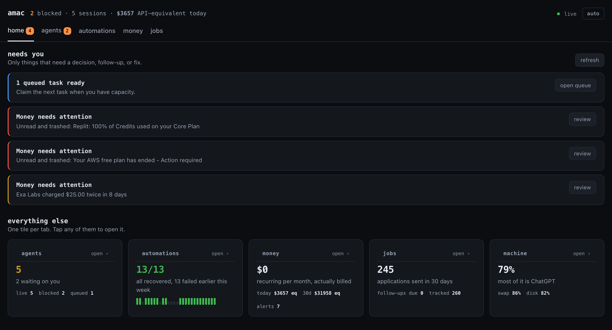
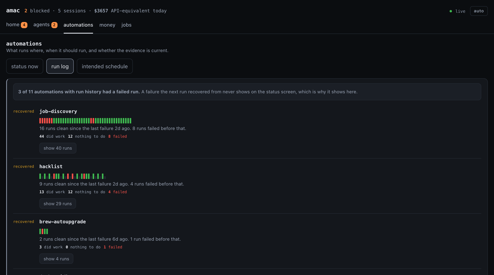
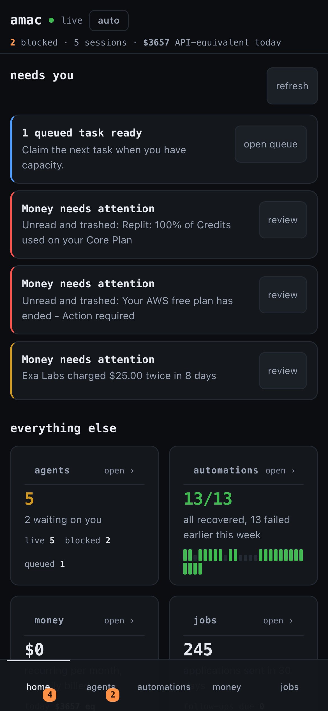

# amac

A local-first control plane for the AI coding agents and automations running on
your Mac. Every session, delivery, permission prompt and action item lives on
one page, on your phone, over Tailscale. Written for one machine, mine, and made
to run on yours.

[](https://github.com/lgoyal6/amac/actions/workflows/ci.yml)
[](LICENSE)
[](go.mod)



## See it without adopting it

```bash
git clone https://github.com/lgoyal6/amac && cd amac
go build -o bin/amac ./cmd/amac
bin/amac demo
```

A seeded week on a throwaway log, bound to localhost. No tailnet, no roster to
write, no hooks installed, and nothing written to `~/.amac`. It opens on a
roster that includes one automation failing right now and one that failed six
times and has been green for three days, because telling those two apart is the
thing worth looking at. Deleting the directory it prints is the whole uninstall.

## Run it for real

```bash
bin/amac hooks -install     # so your agents tell amac what they are doing
bin/amac init               # declare what your automations are meant to deliver
bin/amac daemon             # the board, bound to your tailnet and nothing else
bin/amac url                # the link, token included, to open on your phone
```

Go 1.26+, tmux, and Tailscale for the board. Discord only if you want a phone
notification; everything works without it. Notion and LooseAPI are optional
data sources for Jobs and Money. Nothing runs in a cloud you pay for.

## Why a status page was not enough

For a week this board told me all fourteen automations were healthy. In that
same week they failed thirteen times.

Nothing was lying. A status check reads the newest piece of evidence, and every
one of those failures was followed by a success before anyone looked. The job
that feeds my job search crashed eight times in seven days and the dashboard was
green each time I opened it, because by then it had already recovered.

That is the failure mode this project is really about. Three rules came out of
it, and they are the reason the health code looks the way it does:

- **Count deliveries, not runs.** These pipelines over-schedule on purpose, so
  most runs deliberately no-op and "last run green" is almost always true and
  almost meaningless. The ground truth is the artifact written only after work
  landed.
- **Detect silence.** Nothing pushes an event when a cron fails to fire, so
  every automation declares a cadence and a grace period, and the lateness test
  is applied centrally so no probe can forget it.
- **A failed probe reports `unknown`, never `ok`.** A false all-clear is worse
  than no monitor.

The run log is the other half: every run reported once, whatever happened after
it. A failure the next run rescued still shows up, and a pipeline that has been
fixed says so rather than leading with last week's failures.



## What it does that the terminal cannot

- Which session is blocked, and for how long.
- Which automation stopped *delivering*, as opposed to stopped running.
- A queue agents pull from, one claim per task, proved against SIGKILL.
- The uncommitted diff an agent has actually produced, as opposed to what it
  says it produced.
- What all of it costs.
- Which job follow-up, service alert or credit balance needs action without
  waiting for another dashboard to load.

Agents are not scarce any more; attention is. At any moment there are several
Claude Code and Codex sessions running here, and the hard part is no longer
starting them. It is knowing which one is blocked, what it is about to do, what
it is costing, and being able to answer it from wherever I am.

amac is the layer macOS does not have for that. It is called an OS in the sense
ROS is: not a kernel, but the process model, scheduler, permission system and
journal for a class of thing the host does not manage.

**The core design decision: every transition is an event.** Agent and
automation activity is appended to one journal, so "why did it do that" is
answered by replay rather than by guessing. Small transactional tables hold
state that must be current or atomic, queue ownership and the local Jobs cache,
while external systems enter through explicit adapters rather than screen
scraping.

## The dashboard

One page on the tailnet showing every agent session on this machine, whatever
started it, plus the automations and personal systems those agents maintain. It
installs to a phone's home screen and opens as an app.

```
amac daemon      tailnet only, or it does not start
amac url         the link with the token in it
```



- **Home**: only things that need action. Machine capacity is shown separately
  from automation failure, so a busy Mac does not make a healthy job look red.
- **Agents**: board, wall, queue and crew. Every session's live state, panes,
  work and handoffs are together without crowding the top-level navigation.
- **Automations**: delivery health, schedule and host for every declared job,
  over a live reading of what the Mac has left: memory split the way Activity
  Monitor splits it, plus disk and swap.
- **Money**: agent cost split by login, plus LooseAPI services, trials,
  credits, provider health, alerts and recent billing events.
- **Jobs**: a fast local view of submitted applications, with search, status,
  follow-up dates and Notion sync, over charts of what went out in the last
  thirty days, where those applications are, and how they are tiered.

`blocked, asked 4h ago` hands the judgement to you; `blocked` alone claims
something about right now that the log cannot support.

A pane is **mirrored, never parsed**. The board can answer a permission prompt
in a session amac does not own, but nothing infers what the prompt says: the
bytes go to your phone, you read the options with your own eyes, and you press
the key you want sent. A mirror cannot be confidently wrong, because it makes no
claim. A row of Allow/Deny buttons over a parsed pane can approve the thing you
rejected.

It also reads the uncommitted diff and browses the session's directory, because
an agent that says it fixed the bug and one that has fixed the bug look
identical in a terminal.

## Jobs and Money

These are real workloads on the same control plane, not separate dashboards
embedded in it.

**Jobs is local first.** Browser and email sensors reconcile into one SQLite
row by company and role. The dashboard reads that cache immediately; it never
waits for Notion to render or for its API on an ordinary page load. An explicit
sync imports submitted applications from the existing Notion tracker, while
discovery states such as `New` and `Collected` remain outside the application
view. Status and follow-up changes save locally first and mirror to Notion. If
Notion is unavailable, the edit succeeds and AMAC shows that the backup still
needs to sync.

**Money is a safe projection of LooseAPI.** It shows service totals, trials,
credit balances, alerts, provider health and recent events alongside agent cost
by project and model. Gmail message IDs and subjects never enter the AMAC API;
detailed provider errors stay in LooseAPI's own logs.

## Automation health

Automations are declared in `~/.amac/health.json` with the cadence they are
expected to *deliver* at. A sweep every 15 minutes records a verdict for each
into the log.

```
amac init                   write a starter roster, then validate it
amac health                 check now and print
amac health -alert -quiet   DM only what changed
amac health -runs           every individual run, not just the newest
```

Two things make this a monitor rather than a log:

**It counts deliveries, not runs.** These pipelines are scheduled several times
over for redundancy, so most runs deliberately do nothing and "the last run was
green" is almost always true and almost never informative. Each probe reads the
artifact the automation commits only once work actually landed.

**It detects silence.** A push-based log records the runs that happened and can
never tell you about the run that didn't. Cadence and grace are declared per
automation and the lateness test is applied centrally, so an automation that
dies quietly still produces a finding.

A probe that fails reports `unknown`, never `ok`. For jobs on a box amac cannot
reach, one line is the whole integration:

```bash
curl -X POST -H "X-Amac-Token: $TOKEN" https://your-mac:7788/api/beat/vps-backup
```

A red line can be handed straight to an agent from the health tab, opened in the
directory the automation actually lives in, which comes from the registry, never
inferred from the name.

## Attention

Every signal that means "this session wants you" lands on `amac attention`,
which decides whether to interrupt, delivers it if so, and records the decision
either way, including the suppressed ones and the reason.

Discord is deliberately the notification edge, not a second control plane.
It tells you that a session needs attention and links back to the board; session
input, permission decisions, queue state and history belong to amac. Keeping
actions in one place prevents a button in Discord and a button on the board
from racing to answer the same agent differently.

```
amac attention -claude                     from Claude Code's hooks
amac attention -codex '<notify payload>'   from Codex's notify hook
amac attention -bell -session S            from tmux's alert-bell hook
amac hooks [-install]                      report which of those reach amac
```

**Suppress on focus, not on presence.** The predecessor held a notification back
whenever a tmux client was attached or the keyboard had been touched recently.
Both are true nearly always, so every decision was correct and every alert was
silent, for nine days. amac resolves the frontmost terminal tab to a single tmux
session and suppresses only that one. If the answer cannot be determined the
notification is sent: a spurious ping costs a glance, a missed one costs a
blocked agent nobody notices.

`amac hooks` exists because a subsystem that broke and a wire that was never
connected look identical from a phone. It reports, per agent and per account,
which signals actually reach amac.

## Two agents, four accounts

Two CLIs is not the same as two accounts, and the difference is money. Codex
runs here under two logins with separate homes and separate plans; Claude Code
supports the same split through `CLAUDE_CONFIG_DIR`. Until amac knew that, the
second Codex account was invisible everywhere: its sessions reached no hook, its
tokens reached no cost report, and no screen said an account was missing. A
dashboard that silently covers half the accounts is worse than one that covers
none, because the number it prints looks complete.

```
amac agents      the adapters, and the accounts they run as
```

Which account a session belongs to arrives with the signal rather than being
guessed at: `CODEX_HOME` is inherited by everything Codex spawns, including its
notify hook, and a Claude Code transcript stamps its own account id on itself.
A session that has not reached a hook yet is untagged, not assumed.

The money page lists every known login, including one that spent nothing and one
that is not installed on this machine. Rows lead from the roster rather than
from the logs, because a table of only what was found cannot tell "this account
was quiet" from "this account was never read".

## A queue, and the org

The org is a chain, planner, executor, verifier, which is right when a task
has stages and wrong when there are simply several unrelated things to do.

```
amac task add <title>            file work
amac task claim [-open]          take the next one, optionally opening a session
amac task done -token N <id>     finish it, if you still hold it

amac crew -plan <task>           print the chain, open nothing
amac crew       <task>           open the first role as a session you can take over
```

A claim is a conditional `UPDATE`, not a read of the log: the log answers "what
happened", the table answers "who holds this right now", and only the second has
to be atomic. Every claim carries a fencing token, so a worker whose lease
lapsed has its result rejected on arrival rather than trusted because it
arrived. Proved by causing it, 120 tasks, 6 workers SIGKILLed holding 5 each,
120 finished exactly once, 0 duplicated.

The crew's handoff is a file, not a pipe, which means you can read the plan on
your phone and decide whether the executor should ever see it.

## amac, to the agents

Everything above points one way: amac watches agents and reports to a human.
`amac mcp` turns it around. An agent in a repo otherwise has no idea whether
another agent is already editing the same tree, or whether the pipeline whose
output it is about to trust delivered this morning.

| tool | when an agent should reach for it |
| --- | --- |
| `claim_files` | before the first edit, to take the files you are about to change |
| `release_files` | when you stop editing, so somebody else can have them |
| `working_here` | before editing a tree, so two agents do not produce a diff neither can explain |
| `automation_health` | before trusting a file or feed something else generates |
| `file_task` | for work it found and is not going to do |
| `queue` | before starting something substantial another agent may hold |
| `agent_spend` | when choosing a model for a job that will run many times |
| `report_done` | so a scheduled job it owns is missed when it stops |

**Claims, not courtesy.** `working_here` reports presence: which sessions have a
shell open in a tree. That is a hint, and it says so in its own output. It could
not have prevented what happened to this repository while it was being written:
a peer session ran `git add -A` and swept another session's in-progress files
into a commit about something else, and an hour later a second session branched
under the first. Both were visible to the presence check. Neither was stopped.

`claim_files` is exclusion. It takes a set of paths or none of them, refuses the
whole set if any path is held and names who holds what, and hands back a fencing
token. Holding a directory conflicts with holding a file inside it, in both
directions. Claims carry a lease, so an agent that dies frees its files instead
of locking them until somebody notices, and a revived agent's release is
rejected on arrival rather than trusted because it arrived.

It is the queue's mechanism pointed at a different resource, deliberately, since
that one is already proved against SIGKILL.

Read-mostly on purpose. The three that write are additive. Nothing stops a session
or answers a permission request, because an agent approving another agent's tool
call is the entire reason permission prompts reach a human at all.

## Status

Phase 1, running unattended on this machine. A full session runs end to end
against both agents over [ACP](https://agentclientprotocol.com), an open,
versioned JSON-RPC protocol with adapters for Claude Code, Codex and Gemini CLI.
Tool calls, permission requests and output arrive as structured data, so
`blocked` is a fact rather than a regex over rendered text.

Verified against Claude Agent v0.66.0 and Codex v1.1.14, both protocol v1, both
driven by the same code.

```
amac setup                     install pinned adapters once
amac run -agent codex 'task'   start a session, send a prompt, answer it
amac probe -all                handshake every agent, record capabilities
amac cost                      what amac's own sessions cost
amac log -n 20                 recent events
```

**Roadmap.** Session babysitting is out of scope; Claude Code Remote Control
ships it. What is left is what Remote Control does not reach.

1. ~~**Daemon**: supervise sessions, API, board on the tailnet~~, shipped
2. ~~**Gateway and router**: the cascade is in, the harness measures it without
   showing it the answer key, it runs against a live provider, and the curve
   across a real task set is below~~, measured
3. **Orchestrator**: grade the prompt, convene as many agents as it warrants,
   with a per-task token budget
4. ~~**Sensors**: browser extension and email parsing for an application
   tracker, with a local cache and Notion backup~~, shipped
5. **Observer**: what I am working on, metadata first, pixels only for
   allowlisted apps
6. **Miner**: patterns in the log become suggested automations

## The curve

Seventy tasks drawn from the work amac actually routes: the orchestrator's own
sizing prompt, extraction from real `git`, `tmux`, `launchd`, `ps` and ACP
output, the transcript-tail classification the attention subsystem makes today
by pattern match, and the recall and reasoning the top tier is supposed to earn
its price on. Forty-six of the seventy can be gated the way production gates
them. Run against GMI on 2026-09-05, `amac eval`:

```
ARM               QUALITY 95%       COST    COST/TASK    P50 LAT  ERRORS
cheap            88.6% +/-7.5   $0.00331     $0.00005      2.75s       1
mid              87.1% +/-7.8   $0.00237     $0.00003      1.32s        
strong           90.0% +/-7.0    $0.0296     $0.00042     3.753s        
routed           90.0% +/-7.0   $0.00864     $0.00012     2.765s        

cheap: 1 of 70 calls returned no answer
  deepseek-ai/DeepSeek-V4-Flash spent its whole 2048-token budget reasoning and never answered (finish_reason "length"); raise MaxTokens

versus the strong-model baseline:
  cheap        -89% cost, -1.4 pts quality (within noise)
  mid          -92% cost, -2.9 pts quality (within noise)
  routed       -71% cost, +0.0 pts quality (within noise)

routed gating: 46 of 70 tasks gated as production would; 24 carry their
answer in the check and fell back to non-empty output.
```

**Routing reached the strong model's quality for 71% less.** That is the number
the cascade was built for, and it is the least interesting thing here.

**No quality difference between any two arms survives the sample.** Every
pairwise z is under 0.6, every interval is about seven points wide, and the
whole spread from best arm to worst is 2.9 points. The quality column ranks
nothing. Separating arms three points apart would need something like two
thousand tasks, which is why the table prints its interval and marks every
delta rather than letting four tidy percentages imply an ordering.

The cost column is not a sample. It spans **12.5x**, and the strong tier buys
nothing this suite can measure for it.

Two things fall out that were not the question:

- **The cheap tier is not the cheapest.** DeepSeek-V4-Flash reasons before
  answering, so it spent more than the mid tier while scoring within a point of
  it, and once burned its entire 2048-token budget thinking and never answered.
  A tier named for its rate card is not a tier ordered by cost.
- **On triage, the one call amac makes on its own behalf, the cheap tier scored
  20/20 and the strong tier 19/20.** The orchestrator already sends triage to
  the cheap tier. That was a judgement call when it was written; it is now a
  measurement.

Where the arms actually differ is by family, and it is not where the tiers are
priced:

| family | n | cheap | mid | strong | routed |
| --- | --- | --- | --- | --- | --- |
| extract | 16 | 94% | 100% | 100% | 100% |
| triage | 20 | 100% | 90% | 95% | 95% |
| state | 10 | 100% | 100% | 90% | 90% |
| recall | 12 | 92% | 83% | 92% | 100% |
| reason | 12 | 50% | 58% | 67% | 58% |

Reasoning is where every arm is weak and where the gate is weakest: those
twelve carry their answer in the check, so the cascade falls back to "did it
answer at all" and the graded number is the honest one while the routed number
is not load-bearing there.

## What is guaranteed, and what proves it

Every row is a property the system claims and a test that fails if it stops
holding. They run in CI on every push.

| property | why it matters | proved by |
| --- | --- | --- |
| No work lost or duplicated across a crash | A worker is a process someone can kill, and an agent that dies mid-task must not take the task with it | 120 tasks, 6 workers SIGKILLed holding 5 each, all 120 finish exactly once (`TestNoWorkLostOrDuplicatedAcrossCrashes`) |
| A lapsed lease cannot finish its work | The result of a worker that was already reclaimed is stale, and trusting it because it arrived is how two workers both "succeed" | `TestAFencedWorkerCannotFinishOrRenew` |
| Concurrent claims never overlap | The claim is a conditional `UPDATE`, not a read followed by a write | `TestConcurrentClaimsNeverOverlap` |
| The log is a total order, and replayable | "Why did it do that" is answered by replay rather than by guessing | `TestSequenceIsTotalOrder`, `TestReplayFromSequence` |
| A slow reader cannot stall a writer | The durable record must never depend on a phone holding a connection open | `TestSlowSubscriberDoesNotBlockWriter` |
| Alerting fires on bad-to-bad transitions | Late (went quiet) and failing (ran and broke) are different news; alerting only on ok-to-bad silently swallows the second | `TestAlertOnBadToBadTransition` |
| A probe that fails reports `unknown` | A false all-clear is worse than no monitor | `TestProbeErrorIsUnknown` |
| A start banner is not a run | Several jobs write a start line in the same shape as a completion; counting both doubled one job's history | `TestOnlyCompletionMarkersAreRuns` |
| The digest fits a phone screen | Discord's mobile column is about 40 characters, and a roster that wraps is a roster nobody reads | `TestDigestFitsAPhoneScreen` |
| Two agents cannot hold one file | A claim is all or nothing, conflicts on directory containment both ways, and a revived holder is refused | `TestTwoSessionsCannotHoldTheSameFile`, `TestARevivedHolderCannotReleaseItsReplacement` |
| A dead agent does not lock a tree | 1,024 paths, 16 children SIGKILLed holding 64 each: 1,024 grants over 1,024 distinct paths, all reclaimed once the leases lapsed, 0 stale tokens accepted | `TestNoPathHeldTwiceAcrossCrashes` |
| A permission request blocks until answered | It is the path where an agent asks to do something dangerous and a human approves it | `TestPermissionRequestBlocksUntilAnswered` |
| Auto mode takes the narrowest allow | Standing permission changes what every future turn may do without anyone deciding that | `TestAutoPolicyTakesTheNarrowestAllow` |
| Nothing is observed without an allowlist | A missing policy denies everything, and the kill switch stops it without the daemon cooperating | `TestNoPolicyFileObservesNothing`, `TestTheKillSwitchStopsObservationImmediately` |
| The miner never automates a decision you make | Five approvals and one denial produces nothing; the denial is the judgement the prompt exists to collect | `TestNeverSuggestAutomatingSomethingYouHaveDenied` |
| A cost report never understates spend | Codex reports tokens and no money, so a missing cost is unpriced rather than free | `TestASessionWithoutMoneyIsUnpricedNotFree` |
| Retention never touches the audit trail | An audit log with a retention policy is not an audit log | `TestTheAuditTrailIsNeverTouched` |
| The cascade never sees the answer key | A gate built from the correct answer makes the router escalate until it guesses right, and the routed arm records a quality production cannot reach | `TestGateNeverCarriesTheAnswerKey`, `TestASingleLabelGateWouldMakeTheCascadeOmniscient` |
| An arm that never answered has no score | The strong tier's model id 404'd for its whole life and was reported as 0% quality at $0, which reads as a bad model rather than an absent one | `TestAnArmThatNeverAnsweredHasNoQualityScore`, `TestNoSavingsAreQuotedAgainstABrokenBaseline` |
| Every default model is one the vendor serves | A model id is a string agreed with somebody else, and ids are case-sensitive | `TestEveryDefaultModelIsServed` |
| The curve never claims more than its sample | Four tidy percentages imply an ordering that 70 tasks cannot support | `TestTheMeasuredCurveIsReportedAsIndistinguishable`, `TestARealQualityGapIsNotDismissedAsNoise` |

## Does this run on my machine

**macOS** is what it was built for and where all of it works.

**Linux** runs most of it. Declare local jobs with `systemd_unit` rather than
`launchd_marker`; systemd is the better source, because it records when a run
ended and launchd only records how it ended. What Linux loses is one thing, and
it fails safe: focus-based suppression needs the macOS window server, so
elsewhere the notification is simply sent.

**Windows** builds and is not worth running. Use WSL, where it is Linux.

| | macOS | Linux | Windows |
| --- | --- | --- | --- |
| board, queue, MCP, spend | yes | yes | yes |
| tmux sessions, agent hooks | yes | yes | WSL |
| local scheduled jobs | launchd | systemd | no |
| hosted jobs, heartbeats | yes | yes | yes |
| suppress on focus | yes | always notifies | always notifies |
| keychain credentials | yes | env vars | env vars |

## More

- [How it works, and why](docs/design.md), the long version: what each
  subsystem is guarding against, and the bug that put it there
- [Contributing](CONTRIBUTING.md)

## Keeping the log small

An append-only log grows forever, and the rows do not all age the same way. On
this installation, at 6,839 events and 4.9MB of payload, `attention` is 29% of
the rows and 60% of the bytes because each carries the full text of the message
sent, while `session.state` is 39% of the rows and 8% of the bytes.

So the expensive thing is one field, not the number of decisions, and the tool
is redaction rather than deletion. Dropping the body from an old notification
keeps the timestamp, session, reason and outcome, which is everything the board
reads and everything the analysis is computed from.

```
amac prune            print the plan, change nothing
amac prune -apply     carry it out
amac prune -apply -vacuum   and reclaim the file space
```

Permission requests and answers, actuations, session starts and ends and
automation runs are never touched. That is the audit trail, it is tiny, and an
audit log with a retention policy is not an audit log.

On a copy of the real log with the clock moved forward, 4.9MB becomes 738KB.

## Reading the log in Python

`analysis/` is read-only pandas over the same rows, for questions that want a
dataframe. It is also where the honest answer lives about whether the
notification rule could be learned: it cannot, because the obvious outcome
label measures which adapter reports telemetry rather than what you did. See
[analysis/README.md](analysis/README.md).

## On a phone

The board is a PWA: it installs to the home screen and opens as an app, with no
store and no account. It is designed for that first rather than shrunk to fit.
Every view is checked at 375px, the Discord digest is laid out for a mobile
column about 40 characters wide with tests that fail if a line runs long or a
URL is left inline to spawn a preview card, and a pane is mirrored rather than
parsed so a permission prompt can be answered from a phone by reading the bytes
with your own eyes.

## Writing

[Your green dashboard is lying to you](docs/green-dashboard.md), on why a status
check cannot see a failure that recovered before you looked, and the three rules
that came out of finding thirteen of them behind a green board.

## Licence

[AGPL-3.0](LICENSE). Use it, change it, run it. If you distribute it **or run a modified
version as a network service**, that version has to be open source too, and the
licence carries an express patent grant from every contributor. If you want it
under other terms, ask.
